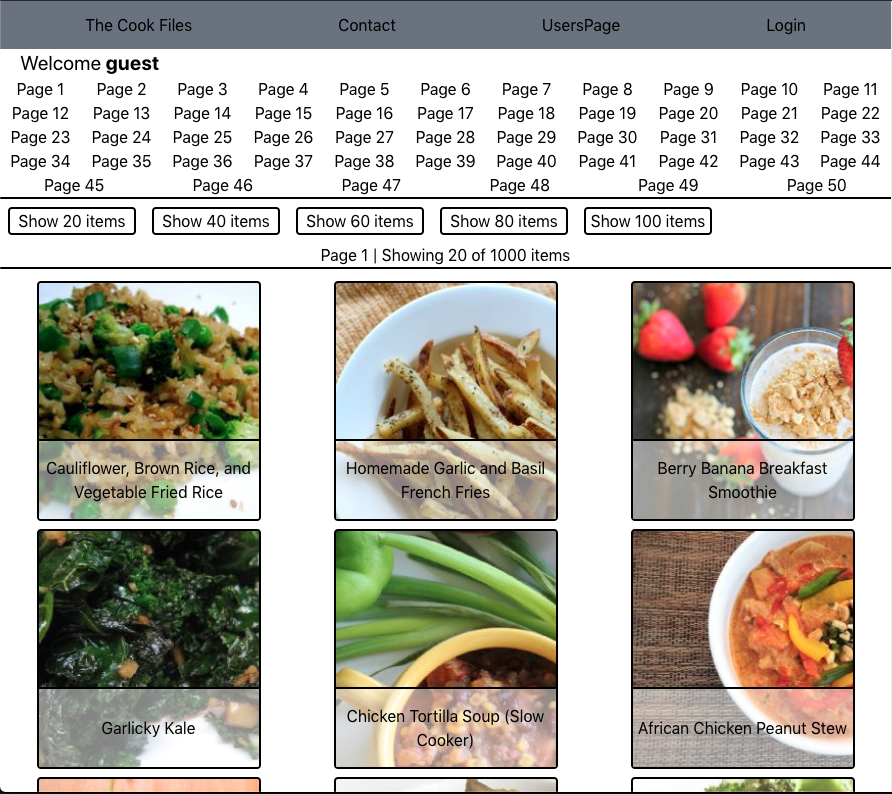
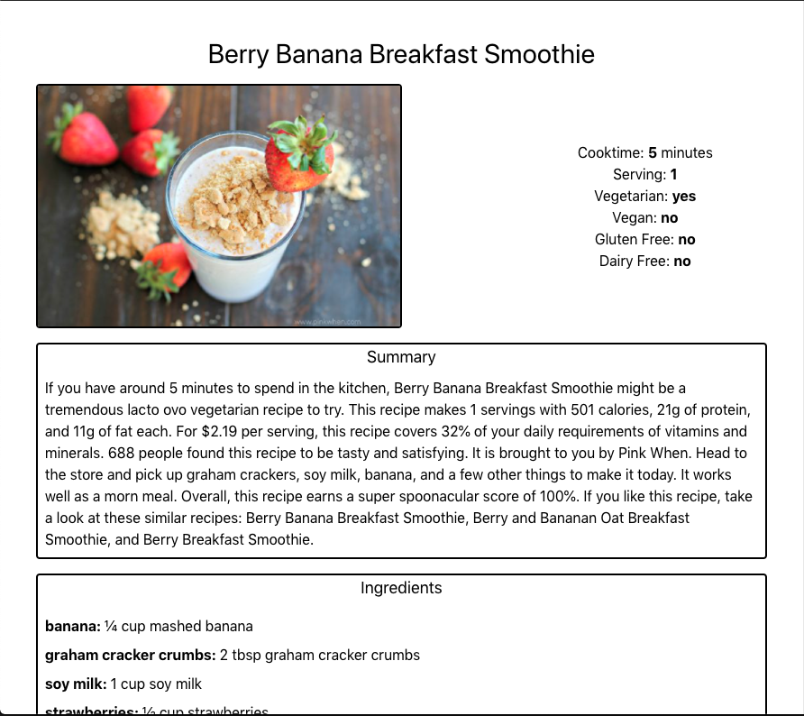

# [The Cook Files](https://60a6f4874ffa210008325a9c--sleepy-wiles-fee4ff.netlify.app/login)
## Website Description
This Website was created for people who wanted to look at recipes and save them to their profile so they can view it later. This website calls upon the [Spoonacular Api](https://spoonacular.com/food-api) and populates the page with recipes. Then save the data to an express backend for later references.

#### Website Features

- Home Page
  
    - A list of recipes for all to see
    - Change amount shown on page
    - Change which page to look at
     
- Login and Create user page 
    - A page where users can create an account and login
- Recipe Page
  
    - A page that displays the recipe's information
    - An add button that shows up if users are logged in
     

## Technologies Used
- React: Routers, Links, export functions
- JavaScript: array methods, callback, Api data
- CSS: Tailwind

## Available Contributions To Be Made
##### All Contributions are optional
- [ ] Backend - routes for post and comments
- [ ] Frontend - comments for each page of recipe for user input
- [ ] Better CSS design
- [ ] Any interesting ideas

